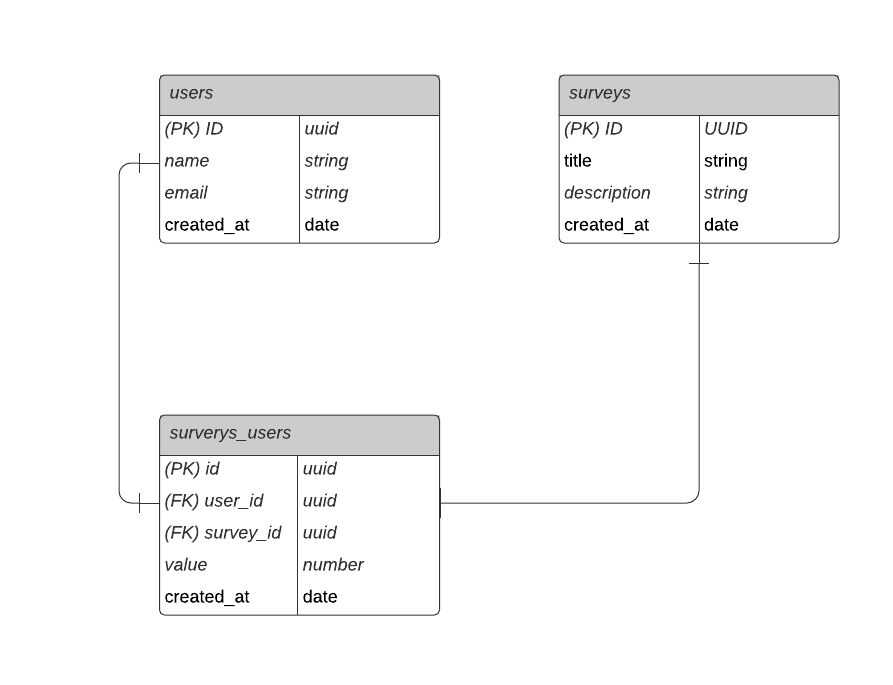

<h1 align="center"> API-NPS </h1>
<p align="center">
  <a href="#sobre"> Sobre a aplicação </a> &nbsp;&nbsp;&nbsp;| &nbsp;&nbsp;&nbsp;
  <a href="#tecnologias">Tecnologias</a> &nbsp;&nbsp;&nbsp;|&nbsp;&nbsp;&nbsp;
  <a href="#instalacao">Instalação</a> &nbsp;&nbsp;&nbsp;|&nbsp;&nbsp;&nbsp;
  <a href="#rotas">Rotas</a> &nbsp;&nbsp;&nbsp;|&nbsp;&nbsp;&nbsp;
  <a href="#licenca">Licença</a> &nbsp;&nbsp;&nbsp;|&nbsp;&nbsp;&nbsp;
  <a href="#dev">Dev</a>
</p>

<p align="center">
  
</p>

<div id="sobre">
  
## :bookmark_tabs: Sobre a aplicação 
Esta é uma API para NPS (Net Promoter Score), desenvolvida na trilha de Node.js durante a Next Level Week #04 (evento oferecido pela [RocketSeat](https://rocketseat.com.br/)).
- Funcionamento: ao criar uma pesquisa e registrar os usuários que irão respondê-la, é possível enviar um e-mail solicitando aos participantes para que respondam o questionário (inicialmente, composto por uma única pergunta, relacionado a nota que o usuário dá a determinado serviço, neste caso, o exemplo usado foi a própria NLW)

Abaixo é possível observar o Diagrama de Entidade e Relacionamento em que a API foi baseada, onde há 3 tabelas: uma para usuários, uma para pesquisas e outra como ponte, relacionando as duas tabelas.

<p align="center">
  
</p>

</div>

<div id="tecnologias">

## 🛠️ Tecnologias
- TypeScript (Linguagem de programação baseada em tipagem)
- Node.js (executa Javascript no lado do servidor)
- Express (framework para servidor)
- TypeORM (ORM baseado em entidades)
- Jest.js (realização de testes)
- SQLite (banco de dados)
- Nodemailer (serviço de envio de email "fake")
- Handlebars (criação de views dinâmicas em relação às variáveis do backend)
- Yup (validação)

</div>

<div id="instalacao">

## ⚙️ Instalação

```bash
# Clone esse repositório
$ git clone https://github.com/MariaGabrielaReis/nlw-04-net-promoter-score.git

# Acesse a pasta da API
$ cd api

# Instale as dependências do projeto, assim como suas tipagens
$ npm install ...
# ou
$ yarn add ...

# Execute a aplicação
$ yarn dev

: '
Para visualizar os dados já cadastrados no banco, instale em seu Visual Studio Code a extenção SQLite.
Pressione as teclas "ctrl" + "shift" + "p" e selecione "api/src/database.sqlite".
Caso queira cadastrar os dados, exclua o arquivo e rode as migrations (criam as tabelas), use o Insomnia para criar os novos registros
'
$ yarn typeorm migration:run

: '
Para utilizar as funcionalidades da aplicação, use o Insomnia para enviar um email com uma pesquisa para algum usuário.
Abra o link do terminal e responda à pesquisa.
Ainda pelo Insominia, ao pedir o cáclulo do NPS, o mesmo será feito a partir das respostas obtidas e cadastradas no banco de dados
'

# Para executar testes com o banco de dados (criação, cadastro e exclusão)
$ yarn test
```

</div>

<div id="rotas">

## 🛤️ Rotas
#### POST
- http://localhost:3333/users (cria usuário)
- http://localhost:3333/surveys (cria pesquisa)
- http://localhost:3333/sendMAil (envia email/ cria instância na tabela "Survey_Users")

#### GET
- http://localhost:3333/surveys (mostra todas as pesquisas cadastradas)
- http://localhost:3333/answers/:value (cadastra a resposta que um usuário deu para a pesquisa)
- http://localhost:3333/nps/:survey_id (calcula o NPs de determinada pesquisa a partir de seu ID)

</div>

<div id="licenca">

## :page_with_curl: Licença
Este projeto está licenciado nos termos da licença MIT. Leia [aqui](LICENCE.txt)

</div>

<div id="dev">

> Maria Gabriela Reis, 2021 :sparkles: <br>
> ❤️ [Github](https://github.com/MariaGabrielaReis)<br>
> 💙 [Linkedin](https://www.linkedin.com/in/mariagabrielareis/)<br>
> 💜 [Rocketseat](https://app.rocketseat.com.br/me/mariagabrielareis)

</div>